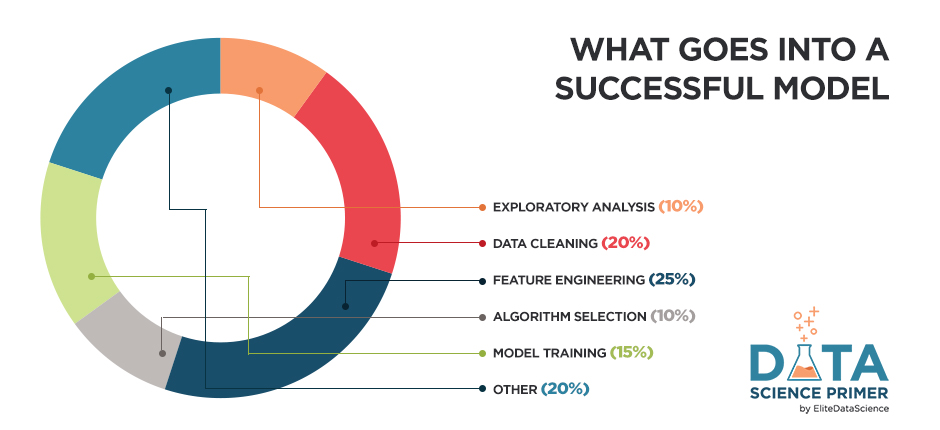

## Reading

[Read: Data Science Primer](https://elitedatascience.com/primer)

## **Machine Learning**

**'Better data beats fancier algorithms'**

Machine learning is the practice of teaching computers how to learn patterns from data, often for making decisions or predictions.

For true machine learning, the computer must be able to learn patterns that it's not explicitly programmed to identify.

### **Terminology**

- Model - a set of patterns learned from data.
- Algorithm - a specific ML process used to train a model.
- Training data - the dataset from which the algorithm learns the model.
- Test data - a new dataset for reliably evaluating model performance.
- Features - Variables (columns) in the dataset used to train the model.
- Target variable - A specific variable you're trying to predict.
- Observations - Data points (rows) in the dataset.

### The 3 Elements of Great Machine Learning

1. A skilled chef (human guidance)

    First, even though we are "teaching computers to learn on their own," human guidance plays a huge role. You'll need to make dozens of decisions along the way.
    
    In fact, the very first major decision is how to road-map your project for guaranteed success.

2. Fresh ingredients (clean, relevant data)

    The second essential element is the quality of your data.

    Garbage In = Garbage Out, no matter which algorithms you use.

    Professional data scientists spend most their time understanding the data, cleaning it, and engineering new features. While that sounds open-ended, you'll get our proven frameworks that you can always rely on as starting points.

3. Don't overcook it (avoid overfitting)

    One of the most dangerous pitfalls in machine learning is overfitting. An overfit model has "memorized" the noise in the training set, instead of learning the true underlying patterns.

    - An overfit model within a hedge fund can cost millions of dollars in losses.
    - An overfit model within a hospital can costs thousands of lives.
    
    For most applications, the stakes won't be quite that high, but overfitting is still the single largest mistake you must avoid. We'll teach you strategies for preventing overfitting by (A) choosing the right algorithms and (B) tuning them correctly.

## **The Blueprint**
Our machine learning blueprint is designed around those 3 elements.

There are 5 core steps:

1. Exploratory Analysis

    **First**, "get to know" the data. This step should be quick, efficient, and decisive.

2. Data Cleaning

    **Then**, clean your data to avoid many common pitfalls. Better data beats fancier algorithms.

3. Feature Engineering

    **Next**, help your algorithms "focus" on what's important by creating new features.

4. Algorithm Selection

    **Choose** the best, most appropriate algorithms without wasting your time.

5. Model Training

    **Finally**, train your models. This step is pretty formulaic once you've done the first 4.

## Videos

[Watch: Machine Learning - Apples and Oranges](https://www.youtube.com/watch?v=cKxRvEZd3Mw)

## Bookmark/Skim

[Data Wrangling](https://elitedatascience.com/python-data-wrangling-tutorial)